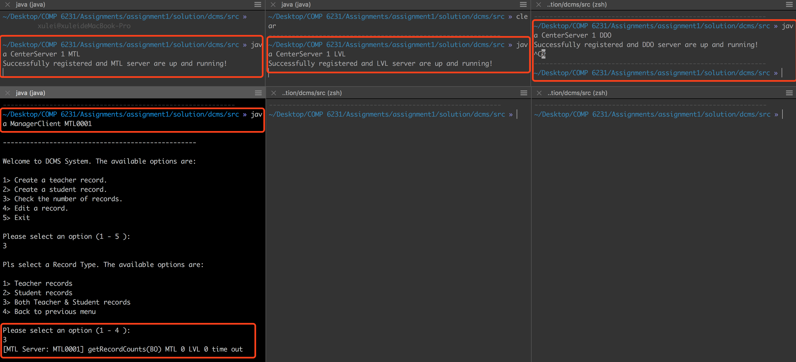

# DCMS Design Documentation

[toc]

<div style="page-break-after: always"></div>

## 1. Background

Our team is going to implement a simple Distributed Class Management System, used by center managers to manage information about teachers and students across different centers.

In the report, we will discuss the key technology (**RMI**) first, then design some proper and sufficient test scenarios to perform a comprehensive test.

## 2. Implementation

### 2.1 Techniques

**RMI** allows us to invoke methods of a remote object, which provides an easy way to spread out our applications on local networks.

> **RMI**, also known as **Java Remote Method Invocation**, is a Java API that performs remote method invocation, the object-oriented equivalent of remote procedure calls (RPC), with support for direct transfer of serialized Java classes and distributed garbage-collection.

RMI also provides a great multi-thread environment for handling incoming requests from clients. Because the server is capsulated as an Object. For each request, server will spawn a new thread which can provide maximum concurrency. Of course, it will bring lots of thread safe issues too. Sometimes we need to balance between the concurrency and thread safe, that means in some cases, the concurrent threads need to be synchronized back to serialized line.

### 2.2 Architecture

As the Figure 2.2.1 shows, the whole DCMS system consists of three center servers (**MTL**, **LVL** and **DDO** respectively) and several clients. The **CenterServer** class creates three instances of the remote object implementation, exports the remote object, and then binds those instances to names (**MTL**, **LVL** and **DDO**) in a Java RMI registry. And then clients look up the remote object by names in the registry, and then invoke methods on the remote object.

<div align=center>

<p style="font-size:10px;font-color:#969696">Figure 2.2.1 DCMS Principle Workflow</p>
</div>

As descriped above, the DCMS is responsible for four parts, which are: 

1. Creating teachers' and students' records
2. Editing teachers' and students' records
3. Getting the number of records
4. Providing the log service

For the first two parts (both teachers and students) - **Creating Records**, the graph below shows how it works.

<div align=center>

<p style="font-size:10px;font-color:#969696">Figure 2.2.2 DCMS Create Records Method Workflow</p>
</div>

For the second part - **Editing Records**, the graph below shows how it works.

<div align=center>

<p style="font-size:10px;font-color:#969696">Figure 2.2.3 DCMS Edit Records Method Workflow</p>
</div>

For the third part - **Getting Records Count**, the graph below shows how it works.

<div align=center>

<p style="font-size:10px;font-color:#969696">Figure 2.2.4 DCMS Get  Records Count Method Workflow</p>
</div>


### 2.3 Implementation

#### 2.3.1 Define the remote interface

Firstly, we need to design an interface (**ClassServiceInterface.java**), where we define the methods that can be invoked by remote clients. 

A remote object is an instance of a class that implements a remote interface. A remote interface extends the interface ***java.rmi.Remote*** and declares a set of remote methods. Each remote method must declare ***java.rmi.RemoteException*** (or a superclass of RemoteException) in its throws clause, in addition to any application-specific exceptions.

Here is the interface definition for the remote interface named **ClassServiceInterface**. It declares just six methods, and the part of source code shows below.

```java
/**
 * Define the interface of the distributed class management system service
 * It must inherit Remote and methods must throw RemoteException
 */
public interface ClassServiceInterface extends Remote {
    public String createTRecord(...) throws RemoteException;
    public String createSRecord(...) throws RemoteException;
    public String getRecordsCount(...) throws RemoteException;
    public String editRecord(...) throws RemoteException;
    public int login(String managerID) throws RemoteException;
    public int logout(String managerID) throws RemoteException;
}
```

#### 2.3.2 Implement the server

Then, we need to implement this interface as a server Class (**CenterServer.java**). And also implemented some auxiliary methods to fulfil the tasks.

A "server" class, in this context, is the class which has a **main** method that creates an instance of the remote object implementation, exports the remote object, and then binds that instance to a name in a *Java RMI registry*. The class that contains this main method could be the implementation class itself, or another class entirely.

In this project, the main method for the server is defined in the class **CenterServer** which also implements the remote interface **ClassServiceInterface**. 

```java
public class CenterServer implements ClassServiceInterface {
	@Override
    public String createTRecord(...) throws RemoteException
    {...}
    @Override
    public String createSRecord(...) throws RemoteException 
    {...}
    @Override
    public String getRecordsCount(...) throws RemoteException 
    {...}
    @Override
    public String editRecord(...) throws RemoteException
    {...}
    // Main Mathod
    public static void main(String[] args) {...}
}
```
Codes below are how we implement auxiliary methods in the **CenterServer** class.

```java
	// Implementation of login with managerID
    // only record the online status, to avoid multi-login with same managerID
	@Override
    public int login(String ManagerID) throws RemoteException {...}
    @Override
    public int logout(String ManagerID) throws RemoteException {...}
    // Synchronized get the ID resource for new teacher record
    public synchronized int getRecordIDTR() throws Exception {...}
    // Synchronized get the ID resource for new student record
    public synchronized int getRecordIDSR() throws Exception {...}
```

#### 2.3.3 Create and export a remote object

The main method of the **CenterServer** needs to create the remote object that provides the service. Additionally, the remote object must be exported to the *Java RMI runtime* so that it may receive incoming remote calls. This can be done as follows:

```java
...
public void exportServer(String location) throws Exception {
	Remote obj = UnicastRemoteObject.exportObject
					(this, this.portNumber);
	...
}
...
```
The static method ***UnicastRemoteObject.exportObject*** exports the supplied remote object to receive incoming remote method invocations on an anonymous port and returns the stub for the remote object to pass to clients. As a result of the exportObject call, the runtime may begin to listen on a new server socket or may use a shared server socket to accept incoming remote calls for the remote object. The returned stub implements the same set of remote interfaces as the remote object's class and contains the host name and port over which the remote object can be contacted.

#### 2.3.4 Register the remote object with a Java RMI registry

A Java RMI registry is a simplified name service that allows clients to get a reference (a stub) to a remote object. In general, a registry is used (if at all) only to locate the first remote object a client needs to use. Then, typically, that first object would in turn provide application-specific support for finding other objects.

Once a remote object is registered on the server, callers can look up the object by name, obtain a remote object reference, and then invoke remote methods on the object.

The following code in the **CenterServer** obtains a stub for a registry on the local host and default registry port and then uses the registry stub to bind names, **MTL** & **LVL** & **DDO**, to the remote object's stub in that registry.

```java
...
public void exportServer(String location) throws Exception {
	Remote obj = UnicastRemoteObject.exportObject(this, this.portNumber);
    Registry registry;
	try{
			registry = LocateRegistry.createRegistry(2020);
		} catch (ExportException e) {
            registry = LocateRegistry.getRegistry(2020);
        }
	registry.rebind(location, obj);
	...
}
public static void main(String[] args) {
	...
    (new CenterServer("MTL")).exportServer("MTL");
    (new CenterServer("LVL")).exportServer("LVL");
    (new CenterServer("DDO")).exportServer("DDO");
    ...
}
```
The static method ***LocateRegistry.getRegistry*** that takes no arguments returns a stub that implements the remote interface ***java.rmi.registry.Registry*** and sends invocations to the registry on server's local host on the defined registry port. The bind method is then invoked on the registry stub in order to bind the remote object's stub to the names, **MTL** & **LVL** & **DDO**, in the registry.

#### 2.3.5 Implement the client

Also we need to use the interface in client Class (**ManagerClient.java**).

```java
public class ManagerClient extends Thread {
	...
	ClassServiceInterface server;
	...
	try {
		...
		server = (ClassServiceInterface) Naming.lookup("rmi://" + serverHost + ":2020/" + serverName);
		...
	} catch(Exception e) {
		e.printStackTrace();
	}
}
```

These steps will generate a skeleton on server side and a stub on client side. After publishing the server on the network and register it to a registry, clients can look up the registry and get the reference of this server, then invoke the method that this server provides just as a local call.

In the construction method of **CenterServer**, we also created a UDP Server thread to accept the incoming requests of **getRecordsCount** method from other servers, the definition and working flow of this UDP server is described above in this document.

```java
public class CenterServer implements ClassServiceInterface {
	private int upLimit;
	private int portNumber;
	private static int udpPortMTL = 2230;
	private static int udpPortLVL = 2231;
	private static int udpPortDDO = 2232;
	private UDPServer udpServer;
	
	public CenterServer (String serverrName) {
	...
	//start the UDP server
    udpServer.start();
    ...
    }
}
```
#### 2.3.6 Synchronize resources (The most important part)

Finally, we need to synchronize resources, the hash map and array list to store the member records, the ID resources to be assigned to members, the server side log files. we choose different ways to synchronize them.

1. For the **ID resources** (in **CenterServer.java**), we simply synchronized the whole method, cause the method to assign ID is very short and run very fast

	```java
	// Synchronized get the ID resource for new teacher record
    public synchronized int getRecordIDTR() throws Exception {
        // TODO Auto-generated method stub
        if (recordIDTR < upLimit) {
            return (++ recordIDTR);
        } else {
            return (-1);     //Id is out of range
        }
    }
    // Synchronized get the ID resource for new student record
    public synchronized int getRecordIDSR() throws Exception {
        // TODO Auto-generated method stub
        if (recordIDSR < upLimit) {
            return (++ recordIDSR);
        } else {
            return (-1);    //Id is out of range
        }
    }
	```
	
2. For the **server side log file** (in **LogFile.java**), cause each server has only one log file, all the threads spawned from this server object need to write logs to this file, only we can do is also synchronize the whole method.

	```java
	// Simple method to synchronized write log, only add date and time before the message 
	public synchronized String writeLog(String msg) {
		try{
			out.write(df.format(new Date()) + ": " + msg + "\r\n");
	    	out.flush(); 
	    }catch (Exception e){
	    	 System.out.println("Failed to write data into the logfile.");
	    }	
		return(msg);
	}
	```
	
3. For the **hash map and array list in the hash map**, because the structure of hash map in our DCMS remains unchanged throughout the whole lifetime of the server object, we never lock the whole hash map.

	When adding a new record, we firstly get the ID resource, and then try to find the right array list according to the first letter of the last name, lock the array list, and then add the
new record. (in **CenterServer.java**)

	```java
	String tempKey = lastName.substring(0, 1).toUpperCase();
   ArrayList<Member> tempList = memberRecords.get(tempKey);
   synchronized(tempList) {
	   tempList.add(student);
   	}
	```
	
	When editing one record in a list, we firstly navigate through the whole hash map, search each array list, when finding the corresponding record, I lock the array list which the record belongs to, and then edit the specified field of this record. Because in our DCMS, there is no delete operation and update operation on last name, all the records will remain in the same position after it is created. That is the reason why we lock the array list only after finding the record. (in **CenterServer.java**)

	```java
	//navigate in array list to find the record
	while (itr.hasNext()){
		Memeber tempMember = itr.next(); 
		if (tempMember.getID().equals(ID)){ 
			synchronized(tempList) {
				. . . . . . //The code to modify the field 
			}
		}
	}
	```

#### 2.3.7 Summary
	
Based on the design and implementation of DCMS above, we can conclude the relations of all the classes.

<div align=center>

<p style="font-size:10px;font-color:#969696">Figure 2.3.1 DCMS UML</p>
</div>

<div align=center>

<p style="font-size:10px;font-color:#969696">Figure 2.3.2 DCMS UML with dependency</p>
</div>

<div style="page-break-after: always"></div>

## 3. Analysis & Test

### 3.1 Scenarios for Functionality

#### 3.1.1 Scenario 01 - Login/Logout

1. **Case 1**

	***Purposes:***
	
	Check Client can assign the right server for ManagerID.

	***Steps:***
	
	1. Run the three servers (**MTL** **LVL** **DDO**): **"java CenterServer 0"**.
	2. Run the following command: **"java ManagerClient MTL0001"**
	3. Run getRecordCounts to check records.
	4. Exit ManagerClient.
	5. Check console messages and logs on both server and client sides.

	***Hypothesis & Analysis:***
	
	Client should analyze this ManagerID MTL0001 and connect to MTL server automatically.
	
	***Result:***
	
	<div align=center>


<p style="font-size:10px;font-color:#969696">Figure 3.1.1 Login & Logout Case01</p>
</div>
	
2. **Case 2**

	***Purposes:***
	
	Check Server can refuse connection with unmatched ManagerID.
	
	***Steps:***
	
	1. Run the three servers (**MTL** **LVL** **DDO**): **"java CenterServer 0"**.
	2. Log in the DDO server with wrong ManagerID, do as the following command: **"java ManagerClient DDO9999999"**
	3. Try to connect to DDO server.
	4. Check console messages.

	***Hypothesis & Analysis:***

	The console returns error message (***The Manager ID is invalid***), and the DDO server refuses connection.

	***Result:***
	
	<div align=center>

<p style="font-size:10px;font-color:#969696">Figure 3.1.2 Login & Logout Case02 Console</p>
</div>

#### 3.1.2 Scenario 02 - Create Teacher Records

1. **Case 1**

	***Purposes:***
	
	Check whether servers can create new teacher records providing right data. Also check **getRecordsCount** and **logging** function are working.

	***Steps:***

	1. Run the three servers (**MTL** **LVL** **DDO**): **"java CenterServer 0"**.
	2. Run the following command: **"java ManagerClient MTL0001"**
	3. Create a new Teacher Records with right data
	4. Run the following command: **"java ManagerClient DDO0001"**
	5. Create a new Teacher Records with right data
	6. Run the following command: **"java ManagerClient LVL0001"**
	7. Create a new Teacher Records with right data
	8. Run getRecordsCount to check records.
	9. Check console messages and logs on both server and client sides.

	***Hypothesis & Analysis:***
	
	The consoles return the messages about teachers' records just created, the same as the log file.
	
	***Result:***
	
	<div align=center>


<p style="font-size:10px;font-color:#969696">Figure 3.1.3 Create Teacher Records Case01</p>
</div>

	
2. **Case 2**

	***Purposes:***
	
	Check Server can find data error about fields' range (**"Specialization"** and **"Location"** ). Also check logging function is working.

	***Steps:***
	
	1. Run the three servers (**MTL** **LVL** **DDO**): **"java CenterServer 0"**.
	2. Run the following command: **"java ManagerClient MTL0001"**
	3. Create new Teacher Records with wrong location data.
	4. Check console messages and logs on both server and client sides. 

	***Hypothesis & Analysis:***
	
	The console returns error message (***The location can only be MTL, LVL or DDO***), the same as the log file.

	***Result:***
	
	<div align=center>


<p style="font-size:10px;font-color:#969696">Figure 3.1.4 Create Teacher Records Case02</p>
</div>

#### 3.1.3 Scenario 03 - Create Student Records

1. **Case 1**

	***Purposes:***
	
	Check Server can create new student records providing right data. Also check getRecordCounts and logging function are working.

	***Steps:***
	
	1. Run the three servers (**MTL** **LVL** **DDO**): **"java CenterServer 0"**.
	2. Run the following command: **"java ManagerClient MTL0001"**
	3. Create a new Student Records with right data
	4. Run the following command: **"java ManagerClient DDO0001"**
	5. Create a new Student Records with right data
	6. Run the following command: **"java ManagerClient LVL0001"**
	7. Create a new Student Records with right data
	8. Run getRecordsCount to check records.
	9. Check console messages and logs on both server and client sides.

	***Hypothesis & Analysis:***
	
	The consoles return the messages about students' records just created, the same as the log file.
	
	***Result:***
	
	<div align=center>


<p style="font-size:10px;font-color:#969696">Figure 3.1.5 Create Student Records Case01</p>
</div>

2. **Case 2**

	***Purpose:***
	
	Check Server can find data error about fields' range (**"CoursesRegistered"** and **"Status"**). Also check logging function is working.

	***Steps:***
	
	1. Run the three servers (**MTL** **LVL** **DDO**): **"java CenterServer 0"**.
	2. Run the following command: **"java ManagerClient MTL0001"**
	3. Create new student Records with wrong courses registered or status. 
	4. Check console messages and logs on both server and client sides. 

	***Hypothesis & Analysis:***
	
	The console returns error message (***Invalid courses registered or status value***), the same as the log file.

	***Result:***
	
	<div align=center>


<p style="font-size:10px;font-color:#969696">Figure 3.1.6 Create Student Records Case02 Console</p>
</div>

#### 3.1.4 Scenario 04 - Edit Records

1. **Case 1**

	***Purpose:***
	
	Check Server can edit exiting records with right data, also check logging function is working.

	***Steps:***
	
	1. Run the three servers (**MTL** **LVL** **DDO**): **"java CenterServer 0"**.
	2. Run the following command: **"java ManagerClient MTL0001"**
	3. Edit one teacher’s record created in previous step with right data 
	4. Edit one student’s record created in previous step with right data 
	5. Check console messages and logs on both server and client sides.

	***Hypothesis & Analysis:***
	
	The consoles return the messages about records just edited, the same as the log file.

	***Result:***
	
	<div align=center>


<p style="font-size:10px;font-color:#969696">Figure 3.1.7 Edit Records Case01 Console</p>
</div>
	
2. **Case 2**

	***Purpose:***
	
	Check Server can find data errors, also check logging function is working.

	***Steps:***
	
	1. Run the three servers (**MTL** **LVL** **DDO**): **"java CenterServer 0"**.
	2. Run the following command: **"java ManagerClient MTL0001"**
	3. Edit one teacher’s record created in previous step with wrong location data.
	4. Edit one student’s record created in previous step with wrong courses registered or status.
	5. Check console messages and logs on both server and client sides.

	***Hypothesis & Analysis:***
	
	The console returns corresponding error message, the same as the log file.

	***Result:***
	
	<div align=center>


<p style="font-size:10px;font-color:#969696">Figure 3.1.8 Edit Records Case02 Console</p>
</div>
	
3. **Case 3**

	***Purpose:***
	
	Check Server has handled the non-exiting records error.

	***Steps:***
	
	1. Run the three servers (**MTL** **LVL** **DDO**): **"java CenterServer 0"**.
	2. Run the following command: **"java ManagerClient MTL0001"**
	3. Edit one teacher’s record with non-exit ID, TR99999
	4. Edit one student’s record with non-exit ID, SR99999
	5. Check console messages and logs on both server and client sides.

	***Hypothesis & Analysis:***
	
	The console returns error message (like **"ERROR: editRecord failed. Cant't find record with XXXX"**), the same as the log file.

	***Result:***
	
	<div align=center>


<p style="font-size:10px;font-color:#969696">Figure 3.1.9 Edit Records Case03 Console</p>
</div>

	<div align=center>

<p style="font-size:10px;font-color:#969696">Figure 3.1.10 Edit Records Case03 Log</p>
</div>

#### 3.1.5 Scenario 05 - Get Record Counts

1. **Case 1**

	***Purpose:***
	
	Check Server can communicate with other servers to get records count.

	***Steps:***
	
	1. Run the three servers (**MTL** **LVL** **DDO**): **"java CenterServer 0"**.
	2. Run the following command: **"java ManagerClient MTL0001"**
	3. Run getRecordsCount (Teacher), getRecordsCount (Student), getRecordsCount (Both) separately.
	4. Check console messages and logs on both server and client sides.

	***Hypothesis & Analysis:***
	
	The consoles return the messages about records' number of all three servers, the same as the log file.

	***Result:***
	
	<div align=center>


<p style="font-size:10px;font-color:#969696">Figure 3.1.11 Get Records Count Case01</p>
</div>
	
2. **Case 2**

	***Purpose:***
	
	Check timeout mechanism in getting records count from other server.

	***Steps:***
	
	1. Run the three servers (**MTL** **LVL** **DDO**): **"java CenterServer 0"**.
	2. Stop server LVL.
	3. Run the following command: **"java ManagerClient MTL0001"**
	4. Run getRecordCounts (Both).
	5. Check console messages and logs on both server and client sides.

	***Hypothesis & Analysis:***
	
	The console returns the "time out" message, the same as the log file.

	***Result:***
	
	<div align=center>


<p style="font-size:10px;font-color:#969696">Figure 3.1.12 Get Records Count Case02</p>
</div>

### 3.2 Scenarios for Concurrency

#### 3.2.1 Scenario 06 - Create Records Simultaneously

1. **Case 1**

	***Purpose:***
	
	1. Check Server can create new records in multi-thread environment.
	2. Check server’s response when ID resources are used up. Also check getRecordsCount and logging function are working.

	***Steps:***
	
	1. Run the three servers (**MTL** **LVL** **DDO**): **"java CenterServer 0"**.
	2. Run 300 threads of client with ManagerID MTL0001 to MTL0300
	3. Run 300 threads of client with ManagerID LVL0001 to LVL0300
	4. Run 300 threads of client with ManagerID DDO0001 to DDO0300
	5. Each thread runs a 112 iterations of createTRecord and createSRecord with random lastName.
	6. Run getRecordsCount to check records.
	7. Exit ManagerClient.
	8. Check console messages and logs on both server and client sides.

	***Hypothesis & Analysis:***
	
	The console will return **"MTL 67200 LVL 67200 DDO 67200"** message, and there are 901 client logs (plus manager client log).

	***Result:***
	
	<div align=center>


<p style="font-size:10px;font-color:#969696">Figure 3.1.13 Create Records Simultaneously</p>
</div>


#### 3.2.2 Scenario 07 - Create & Edit Records Simultaneously

1. **Case 1**

	***Purpose:***
	
	Check Server can create new records and edit exiting data in multi-thread environment. Also check getRecordCounts and logging function are working.

	***Steps:***
	
	1. Run the three servers (**MTL** **LVL** **DDO**): **"java CenterServer 0"**
	2. Run 400 threads of client with ManagerID MTL0001-MTL0400
	3. 200 threads runs a 150 iterations of createTRecord and createSRecord with random lastName.
	4. 100 threads runs a 150 iterations of edit one same Teacher record. 
	5. 100 threads runs a 150 iterations of edit one same student record. 
	6. Run getRecordsCount to check records.
	7. Exit ManagerClient.
	8. Check console messages and logs on both server and client sides.

	***Hypothesis & Analysis:***
	
	The console will return **"MTL 60000 LVL 0 DDO 0"** message, and there are 401 client logs (plus manager client log).

	***Result:***
	
	<div align=center>


<p style="font-size:10px;font-color:#969696">Figure 3.1.14 Create & Edit Records Simultaneously</p>
</div>