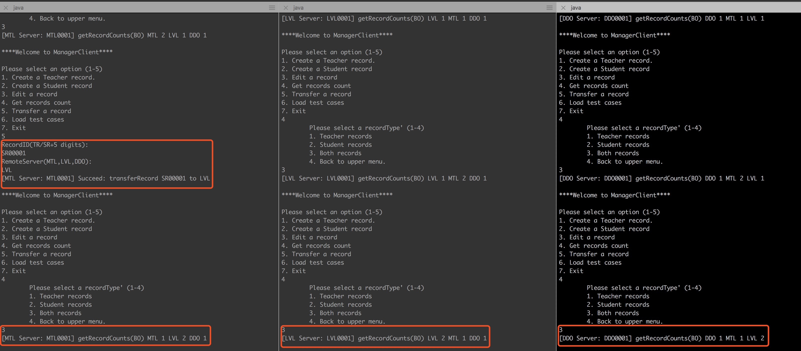

# DCMS Design Documentation - CORBA Version

[toc]

<div style="page-break-after: always"></div>

## 1. Background

Our team is going to implement a simple Distributed Class Management System, used by center managers to manage information about teachers and students across different centers.

In the report, we will discuss the key technology (**CORBA**) first, then design some proper and sufficient test scenarios to perform a comprehensive test.

## 2. Implementation

### 2.1 Techniques

**CORBA** allows programs at different locations and developed by different vendors to communicate in a network through an "**interface broker**". It is an architecture and specification for creating, distributing, and managing distributed program objects in a network. 

> **CORBA**, also known as **Common Object Request Broker Architecture**, is an industry standard developed by the OMG (a consortium of more than 700 companies) to aid in distributed objects programming. CORBA is just a specification for creating and using distributed objects. CORBA is not a programming language.

CORBA also provides a great multi-thread environment for handling incoming requests from clients. Because the server is capsulated as an Object. For each request, server will spawn a new thread which can provide maximum concurrency. Of course, it will bring lots of thread safe issues too. Sometimes we need to balance between the concurrency and thread safe, that means in some cases, the concurrent threads need to be synchronized back to serialized line.

CORBA was designed to be platform and language independent. Therefore, CORBA objects can run on any platform, located anywhere on the network, and can be written in any language that has Interface Definition Language (**IDL**) mappings. IDL defines the object-oriented interface to the logic the system will use or implement.  

<div align=center>

<p style="font-size:10px;font-color:#969696">Figure 2.1.1 CORBA Infrastructure</p>
</div>

This figure above illustrates the high-level paradigm for remote interprocess communications using CORBA. The CORBA specification further addresses data typing, exceptions, network protocols, communication timeouts, etc. For example: Normally the server side has the Portable Object Adapter (**POA**) that redirects calls either to the local servants or (to balance the load) to the other servers.

<div align=center>

<p style="font-size:10px;font-color:#969696">Figure 2.1.2 Portable Object Adapter</p>
</div>

### 2.2 Architecture

As the Figure 2.2.1 shows, the whole DCMS system consists of three center servers (**MTL**, **LVL** and **DDO** respectively) and several clients. The **CenterServant** class creates three instances of the remote object implementation, exports the remote object, and then binds those instances to names (**MTL**, **LVL** and **DDO**) in the **Naming Service**. And then clients look up the remote object by names in the Naming Service module, and then invoke methods on the remote object.

<div align=center>

<p style="font-size:10px;font-color:#969696">Figure 2.2.1 DCMS Principle Workflow</p>
</div>

As descriped above, the DCMS is responsible for five parts, which are: 

1. Creating teachers' and students' records
2. Editing teachers' and students' records
3. Getting the number of records
4. Transferring records from one server to another
5. Providing the log service

For the first two parts (both teachers and students) - **Creating Records**, the graph below shows how it works.

<div align=center>

<p style="font-size:10px;font-color:#969696">Figure 2.2.2 DCMS Create Records Method Workflow</p>
</div>

For the second part - **Editing Records**, the graph below shows how it works.

<div align=center>

<p style="font-size:10px;font-color:#969696">Figure 2.2.3 DCMS Edit Records Method Workflow</p>
</div>

For the third part - **Getting Records Count**, the graph below shows how it works.

<div align=center>

<p style="font-size:10px;font-color:#969696">Figure 2.2.4 DCMS Get  Records Count Method Workflow</p>
</div>

For the forth part - **Transferring Records**, the graph below shows how it works.

<div align=center>

<p style="font-size:10px;font-color:#969696">Figure 2.2.5 DCMS Transfer Records Method Workflow</p>
</div>

### 2.3 Implementation

Similar to RMI, CORBA objects are specified with interfaces. Interfaces in CORBA, however, are specified in IDL. While IDL is similar to C++, it is important to note that IDL is not a programming language. 

There are six steps involved in developing the DCMS application in CORBA. These are:

1. Define an interface in IDL
2. Map the IDL interface to Java (Done automatically)
3. Implement the interface
4. Develop the server
5. Develop a client
6. Synchronize resources (The most important part)
7. Run the naming service, the server, and then the client.

#### 2.3.1 Define an interface in IDL

Firstly, we need to write an IDL file (**Center.idl**), where we define the methods that can be invoked by remote clients. 

Here is the interface definition in IDL. It declares just seven methods, and the part of source code shows below.

Note that the each method in **Center Interface** takes one parameter of type string that is declared **in**.

> IDL defines three parameter-passing modes: **in** (for input from client to server), **out** (for output from server to client), and **inout** (used for both input and output).

```java
module CenterModule {
	interface Center {
		string createTRecord(in string firstName ...);
		string createSRecord(in string firstName ...);
		string getRecordCounts(in string recordType ...);
		string editRecord(in string recordID ...);
		string transferRecord(in string recordID ...);
		long login(in string ManagerID);
		long logout(in string ManagerID);
	};
};
```

Once finishing defining the IDL interface, we need to compile it. Using the command below:

```
idlj -fall Center.idl
```

This command generates seven files such as Stub, holder and helper classes, and others. An important file that gets generated is the **_CenterImplBase**, which will be subclassed by the class that implements the interface.

#### 2.3.2 Implement the interface

Then, we provide an implementation to those methods (**CenterServant.java**). This implementation is known as a servant, and as you can see from the source code below, the class **CenterServant** extends the **_CenterImplBase** class to specify that this servant is a CORBA object.

```java
public class CenterServant extends _CenterImplBase {
	public CenterServant(String location, String host, String port) {}
	@Override
	public String createTRecord(String firstName, ...) {}
	@Override
	public String createSRecord(String firstName, ...) {}
	@Override
	public String editRecord(String ID, ...) {}
	@Override
	public String getRecordCounts(String recordType,String ManagerID) {}
	@Override
	public String transferRecord(String recordID, ...) {}
}
```
In the construction method of **CenterServant**, we also created a UDP Server thread to accept the incoming requests of **getRecordCounts** method from other servers, the definition and working flow of this UDP server is described above in this document.

```java
private int upLimit;
private int portNumber;
private static int udpPortMTL = 2230;
private static int udpPortLVL = 2231;
private static int udpPortDDO = 2232;
private UDPServer udpServer;
public CenterServant(String location, String host, String port) {
	...
	//start the UDP server
    udpServer.start();
    ...
}
```

In this class, I also implemented some auxiliary methods to fulfill the tasks.

```java
//synchronized get the ID resource for new teacher record
public synchronized int getRecordIdTR() throws Exception {...}
//synchronized get the ID resource for new student record
public synchronized int getRecordIdSR() throws Exception {...}
//The real method to synchronized get member count 
//can be referenced by object itself or the UDP Server 
public String getMemberCount(String recordType) {...}
@Override
public int login(String ManagerID) {...}
@Override
public int logout(String ManagerID) {...}
```

#### 2.3.3 Develop the server

Then, we need to implement a class (**CenterServer.java**) to develop the server through following steps below :

1. To start the server, we need to initialize an ORB object:

	```java
	ORB orb = ORB.init(
		new String[] {
			"-ORBInitialPort",argv[2],"-ORBInitialHost",argv[1]
			},null);
	```

2. Create a server object and connect to the ORB:

	```java
	CenterServant MTL = new CenterServant("MTL",argv[1],argv[2]);
   CenterServant LVL = new CenterServant("LVL",argv[1],argv[2]);
   CenterServant DDO = new CenterServant("DDO",argv[1],argv[2]);
	orb.connect(MTL);
	orb.connect(LVL);
	orb.connect(DDO);
	```

3. Find the naming service:

	```java
	org.omg.CORBA.Object objRef =
          	zrb.resolve_initial_references("NameService");
	NamingContext ncRef = NamingContextHelper.narrow(objRef);
	NameComponent nc = new NameComponent("MTL","");
	NameComponent path[] = {nc};
	```

4. Bind the server to the naming service:

	```java
	ncRef.rebind(path, MTL);
	```
	
#### 2.3.4 Develop a client

The next step is to develop a client (**ManagerClient.java**). An implementation is shown in source code below. Once a reference to the naming service has been obtained, it can be used to access the naming service and find other services (for example the **ServerRef** service). When the ServerRef service is found, methods (for example **createTRecord**) will be invoked.

1. Initialize ORB object:

	```java
	ORB orb = ORB.init(
		new String[]{
			"-ORBInitialPort",myServerPort,"-ORBInitialHost",myServerHost
			},null);
	```
	
2. Find the naming service:
	
	```java
	org.omg.CORBA.Object objRef =
          orb.resolve_initial_references("NameService");
   NamingContext ncRef = NamingContextHelper.narrow(objRef);
	```
	
3. Find the serve and get the server reference:

	```java
	NameComponent nc = new NameComponent(serverName,"");
	NameComponent path[] = {nc};
	Center ServerRef = CenterHelper.narrow(ncRef.resolve(path));
	```

4. Then we can invoke the methods through this server reference just as we call a local method, for example:

	```java
	ServerRef.createTRecord(...);
	```
	
#### 2.3.5 Synchronize resources (The most important part)

Finally, we need to synchronize resources, the hash map and array list to store the member records, the ID resources to be assigned to members, the server side log files. we choose different ways to synchronize them.

1. For the **ID resources** (in **CenterServant.java**), we simply synchronized the whole method, cause the method to assign ID is very short and run very fast.

	```java
	//synchronized get the ID resource for new teacher record
	public synchronized int getRecordIdTR() throws Exception { 
		if (recordIdTR < upLimit) {
			return (++ recordIdTR);
		} else {
			return (-1); //Id is out of range
		}
	}	
	```
	
2. For the **server side log file** (in **logFile.java**), cause each server has only one log file, all the threads spawned from this server object need to write logs to this file, only we can do is also synchronize the whole method.

	```java
	//simple method to synchronized write log, only add date and time before the message
	public synchronized String writeLog(String msg){
		try{
				out.write(df.format(new Date())+": "+msg+"\r\n"); out.flush();
		} catch(Exception e) {
				System.out.println("Write to logfile failed.");
		} 
		return(msg);
	}
	```
	
3. For the **hash map and array list in the hash map**, because the structure of hash map in our DCMS remains unchanged throughout the whole lifetime of the server object, we never lock the whole hash map.

	```java
	Synchronized (tempList) { tempList.add (newTR);}
	```

	When adding a new record, we firstly get the ID resource, and then try to find the right array list according to the first letter of the last name, lock the array list, and then add the
new record. (in **CenterServant.java**)

	```java
	String tempKey = lastName.substring(0, 1).toUpperCase();
   ArrayList<Member> tempList = memberRecords.get(tempKey);
   synchronized(tempList) {
	   tempList.add(student);
   	}
	```
	
	When editing one record in a list, we firstly navigate through the whole hash map, search each array list, when finding the corresponding record, I lock the array list which the record belongs to, and then edit the specified field of this record. Because in our DCMS, there is no delete operation and update operation on last name, all the records will remain in the same position after it is created. That is the reason why we lock the array list only after finding the record. (in **CenterServant.java**)

	```java
	//navigate in array list to find the record
	while (itr.hasNext()){
		Memeber tempMember = itr.next(); 
		if (tempMember.getID().equals(ID)){ 
			synchronized(tempList) {
				. . . . . . //The code to modify the field 
			}
		}
	}
	```
	
	When transferring one record to a remote server, I firstly navigate through the whole hash map, lock each array list one by one, search within each array list, when I find the corresponding record, I will firstly invoke a remote method of creating a same record on remote serve, and only after the remote call successfully returned, I delete the record on local server then unlock the array list. In this way, it can solve the
problem of concurrent operations of edit and transfer or multi-transfers.

	```java
	synchronized(tempList) {
	//lock the code block for further operation within the array list
   		//navigate in array list to find the record
		Iterator<staffRecord> itr= tempList.iterator(); 
		while(itr.hasNext()) {
			staffRecord tempStaff = itr.next();
			if(tempStaff.getID().equals(recordID)) { //find the record
				. . . . . . //The code to transfer the record
          }//end of find the record
       }//end of one array list
   }//end of lock array list
	```
	
#### 2.3.6 Run the naming service, the server, and then the client.

1. Run the following command to start the naming service:

	```
	> cd /Library/Java/JavaVirtualMachines/jdk1.8.0_121.jdk/Contents/Home/bin
	> tnameserv -ORBInitialPort 1051
	```

2. Run the following command to start the server:

	```
	> java -classpath ./out Core.CenterServer 0 127.0.0.1 1051
	```

3. Run the following command to start the client:

	```
	> java -classpath ./out Core.ManagerClient MTL0001 127.0.0.1 1051
	```

#### 2.3.7 Summary
	
Based on the design and implementation of DCMS discussed above, we can conclude the relations of all the classes.

<div align=center>

<p style="font-size:10px;font-color:#969696">Figure 2.3.1 DCMS UML</p>
</div>

<div align=center>

<p style="font-size:10px;font-color:#969696">Figure 2.3.2 DCMS UML with dependency</p>
</div>

<div style="page-break-after: always"></div>

## 3. Analysis & Test

### 3.1 Scenarios for Functionality

#### 3.1.1 Scenario 01 - Login/Logout

1. **Case 1**

	***Purposes:***
	
	Check Client can assign the right server for ManagerID.

	***Steps:***
	
	1. Run the three servers (**MTL** **LVL** **DDO**): **"java -classpath ./out Core.CenterServer 0 127.0.0.1 1051"**.
	2. Run the following command: **"java -classpath ./out Core.ManagerClient MTL0001 127.0.0.1 1051"**
	3. Run getRecordCounts to check records.
	4. Exit ManagerClient.
	5. Check console messages and logs on both server and client sides.

	***Hypothesis & Analysis:***
	
	Client should analyze this ManagerID MTL0001 and connect to MTL server automatically.
	
	***Result:***
	
	<div align=center>


<p style="font-size:10px;font-color:#969696">Figure 3.1.1 Login & Logout Case01</p>
</div>
	
2. **Case 2**

	***Purposes:***
	
	Check Server can refuse connection with unmatched ManagerID.
	
	***Steps:***
	
	1. Run the three servers (**MTL** **LVL** **DDO**): **"java -classpath ./out Core.CenterServer 0 127.0.0.1 1051"**.
	2. Log in the LVL server with wrong ManagerID, do as the following command: **"java -classpath ./out Core.ManagerClient LVL9999999 127.0.0.1 1051"**
	3. Try to connect to LVL server.
	4. Check console messages.

	***Hypothesis & Analysis:***

	The console returns error message (***The Manager ID is invalid***), and the LVL server refuses connection.

	***Result:***
	
	<div align=center>

<p style="font-size:10px;font-color:#969696">Figure 3.1.2 Login & Logout Case02 Console</p>
</div>

#### 3.1.2 Scenario 02 - Create Teacher Records

1. **Case 1**

	***Purposes:***
	
	Check whether servers can create new teacher records providing right data. Also check **getRecordsCount** and **logging** function are working.

	***Steps:***

	1. Run the three servers (**MTL** **LVL** **DDO**): **"java -classpath ./out Core.CenterServer 0 127.0.0.1 1051"**.
	2. Run the following command: **"java -classpath ./out Core.ManagerClient MTL0001 127.0.0.1 1051"**
	3. Create a new Teacher Records with right data
	4. Run the following command: **"java -classpath ./out Core.ManagerClient DDO0001 127.0.0.1 1051"**
	5. Create a new Teacher Records with right data
	6. Run the following command: **"java -classpath ./out Core.ManagerClient LVL0001 127.0.0.1 1051"**
	7. Create a new Teacher Records with right data
	8. Run getRecordCounts to check records.
	9. Check console messages and logs on both server and client sides.

	***Hypothesis & Analysis:***
	
	The consoles return the messages about teachers' records just created, the same as the log file.
	
	***Result:***
	
	<div align=center>


<p style="font-size:10px;font-color:#969696">Figure 3.1.3 Create Teacher Records Case01</p>
</div>

	
2. **Case 2**

	***Purposes:***
	
	Check Server can find data error about fields' range (**"Specialization"** and **"Location"** ). Also check logging function is working.

	***Steps:***
	
	1. Run the three servers (**MTL** **LVL** **DDO**): **"java -classpath ./out Core.CenterServer 0 127.0.0.1 1051"**.
	2. Run the following command: **"java -classpath ./out Core.ManagerClient MTL0001 127.0.0.1 1051"**
	3. Create new Teacher Records with wrong location data.
	4. Check console messages and logs on both server and client sides. 

	***Hypothesis & Analysis:***
	
	The console returns error message (***The location can only be MTL, LVL or DDO***), the same as the log file.

	***Result:***
	
	<div align=center>


<p style="font-size:10px;font-color:#969696">Figure 3.1.4 Create Teacher Records Case02</p>
</div>

#### 3.1.3 Scenario 03 - Create Student Records

1. **Case 1**

	***Purposes:***
	
	Check Server can create new student records providing right data. Also check getRecordCounts and logging function are working.

	***Steps:***
	
	1. Run the three servers (**MTL** **LVL** **DDO**): **"java -classpath ./out Core.CenterServer 0 127.0.0.1 1051"**.
	2. Run the following command: **"java -classpath ./out Core.ManagerClient MTL0001 127.0.0.1 1051"**
	3. Create a new Student Records with right data
	4. Run the following command: **"java -classpath ./out Core.ManagerClient DDO0001 127.0.0.1 1051"**
	5. Create a new Student Records with right data
	6. Run the following command: **"java -classpath ./out Core.ManagerClient LVL0001 127.0.0.1 1051"**
	7. Create a new Student Records with right data
	8. Run getRecordCounts to check records.
	9. Check console messages and logs on both server and client sides.

	***Hypothesis & Analysis:***
	
	The consoles return the messages about students' records just created, the same as the log file.
	
	***Result:***
	
	<div align=center>


<p style="font-size:10px;font-color:#969696">Figure 3.1.5 Create Student Records Case01</p>
</div>

2. **Case 2**

	***Purpose:***
	
	Check Server can find data error about fields' range (**"CoursesRegistered"** and **"Status"**). Also check logging function is working.

	***Steps:***
	
	1. Run the three servers (**MTL** **LVL** **DDO**): **"java -classpath ./out Core.CenterServer 0 127.0.0.1 1051"**.
	2. Run the following command: **"java -classpath ./out Core.ManagerClient MTL0001 127.0.0.1 1051"**
	3. Create new student Records with wrong courses registered or status. 
	4. Check console messages and logs on both server and client sides. 

	***Hypothesis & Analysis:***
	
	The console returns error message (***Invalid courses registered or status value***), the same as the log file.

	***Result:***
	
	<div align=center>


<p style="font-size:10px;font-color:#969696">Figure 3.1.6 Create Student Records Case02 Console</p>
</div>

#### 3.1.4 Scenario 04 - Edit Records

1. **Case 1**

	***Purpose:***
	
	Check Server can edit exiting records with right data, also check logging function is working.

	***Steps:***
	
	1. Run the three servers (**MTL** **LVL** **DDO**): **"java -classpath ./out Core.CenterServer 0 127.0.0.1 1051"**.
	2. Run the following command: **"java -classpath ./out Core.ManagerClient MTL0001 127.0.0.1 1051"**
	3. Edit one teacher’s record created in previous step with right data 
	4. Edit one student’s record created in previous step with right data 
	5. Check console messages and logs on both server and client sides.

	***Hypothesis & Analysis:***
	
	The consoles return the messages about records just edited, the same as the log file.

	***Result:***
	
	<div align=center>


<p style="font-size:10px;font-color:#969696">Figure 3.1.7 Edit Records Case01 Console</p>
</div>
	
2. **Case 2**

	***Purpose:***
	
	Check Server can find data errors, also check logging function is working.

	***Steps:***
	
	1. Run the three servers (**MTL** **LVL** **DDO**): **"java -classpath ./out Core.CenterServer 0 127.0.0.1 1051"**.
	2. Run the following command: **"java -classpath ./out Core.ManagerClient MTL0001 127.0.0.1 1051"**
	3. Edit one teacher’s record created in previous step with wrong location data.
	4. Edit one student’s record created in previous step with wrong courses registered or status.
	5. Check console messages and logs on both server and client sides.

	***Hypothesis & Analysis:***
	
	The console returns corresponding error message, the same as the log file.

	***Result:***
	
	<div align=center>


<p style="font-size:10px;font-color:#969696">Figure 3.1.8 Edit Records Case02 Console</p>
</div>
	
3. **Case 3**

	***Purpose:***
	
	Check Server has handled the non-exiting records error.

	***Steps:***
	
	1. Run the three servers (**MTL** **LVL** **DDO**): **"java -classpath ./out Core.CenterServer 0 127.0.0.1 1051"**.
	2. Run the following command: **"java -classpath ./out Core.ManagerClient MTL0001 127.0.0.1 1051"**
	3. Edit one teacher’s record with non-exit ID, TR99999
	4. Edit one student’s record with non-exit ID, SR99999
	5. Check console messages and logs on both server and client sides.

	***Hypothesis & Analysis:***
	
	The console returns error message (like **"ERROR: editRecord failed. Cant't find record with XXXX"**), the same as the log file.

	***Result:***
	
	<div align=center>


<p style="font-size:10px;font-color:#969696">Figure 3.1.9 Edit Records Case03 Console</p>
</div>

	<div align=center>

<p style="font-size:10px;font-color:#969696">Figure 3.1.10 Edit Records Case03 Log</p>
</div>

#### 3.1.5 Scenario 05 - Transfer Records

1. **Case 1**

	***Purpose:***
	
	Check the server can transfer an existing record to another remote server.

	***Steps:***
	
	1. Run the three servers (**MTL** **LVL** **DDO**): **"java -classpath ./out Core.CenterServer 0 127.0.0.1 1051"**.
	2. Run the following command: **"java -classpath ./out Core.ManagerClient MTL0001 127.0.0.1 1051"**
	3. Run transfer the record SR00001 to the LVL server.
	4. Check console messages and logs on both server and client sides.

	***Hypothesis & Analysis:***
	
	The console shows the message "Succeed: transferRecord SR00001 to LVL", the same as the log file.

	***Result:***
	
	<div align=center>


<p style="font-size:10px;font-color:#969696">Figure 3.1.11 Transfer Record Case01</p>
</div>
	
2. **Case 2**

	***Purpose:***
	
	Check the server can refuse to transfer a record to same server.

	***Steps:***
	
	1. Run the three servers (**MTL** **LVL** **DDO**): **"java -classpath ./out Core.CenterServer 0 127.0.0.1 1051"**.
	2. Run the following command: **"java -classpath ./out Core.ManagerClient MTL0001 127.0.0.1 1051"**
	3. Run transfer record TR00001 to the MTL server.
	4. Check console messages and logs on both server and client sides.

	***Hypothesis & Analysis:***
	
	The console returns error message (like **"ERROR: transferRecord failed. Cant't transfer to the same server, may cause deadlock"**), the same as the log file.

	***Result:***
	
	<div align=center>


<p style="font-size:10px;font-color:#969696">Figure 3.1.12 Transfer Record Case02</p>
</div>

3. **Case 3**

	***Purpose:***
	
	Check the server can handle failure during the atomic operation of transferring.

	***Steps:***
	
	1. Add a sleep code to server in the transfer method. 
	2. Run three servers (**MTL** **LVL** **DDO**): **"java -classpath ./out Core.CenterServer 0 127.0.0.1 1051"**.
	3. Run the following command: **"java -classpath ./out Core.ManagerClient 1 127.0.0.1 1051 MTL0001"** to start the MTL server.
	4. Run the following command: **"java -classpath ./out Core.ManagerClient 1 127.0.0.1 1051 DDO0001"** to start the LVL server.
	4. Stop the DDO server.
	5. Run transfer record TR00001 to DDO on client1.
	6. Check console messages and logs on both server and client sides.

	***Hypothesis & Analysis:***
	
	The console returns error message (like **"ERROR: transferRecord failed. Cant't create record on the remote server DDO"**), the same as the log file.

	***Result:***
	
	<div align=center>


<p style="font-size:10px;font-color:#969696">Figure 3.1.13 Transfer Record Case03</p>
</div>

#### 3.1.6 Scenario 06 - Get Record Counts

1. **Case 1**

	***Purpose:***
	
	Check Server can communicate with other servers to get records count.

	***Steps:***
	
	1. Run the three servers (**MTL** **LVL** **DDO**): **"java -classpath ./out Core.CenterServer 0 127.0.0.1 1051"**.
	2. Run the following command: **"java -classpath ./out Core.ManagerClient MTL0001 127.0.0.1 1051"**
	3. Run getRecordsCount (Teacher), getRecordsCount (Student), getRecordsCount (Both) separately.
	4. Check console messages and logs on both server and client sides.

	***Hypothesis & Analysis:***
	
	The consoles return the messages about records' number of all three servers, the same as the log file.

	***Result:***
	
	<div align=center>


<p style="font-size:10px;font-color:#969696">Figure 3.1.14 Get Records Count Case01</p>
</div>
	
2. **Case 2**

	***Purpose:***
	
	Check timeout mechanism in getting records count from other server.

	***Steps:***
	
	1. Run the three servers (**MTL** **LVL** **DDO**): **"java -classpath ./out Core.CenterServer 0 127.0.0.1 1051"**.
	2. Stop server LVL.
	3. Run the following command: **"java -classpath ./out Core.ManagerClient MTL0001 127.0.0.1 1051"**
	4. Run getRecordCounts (Both).
	5. Check console messages and logs on both server and client sides.

	***Hypothesis & Analysis:***
	
	The console returns the "time out" message, the same as the log file.

	***Result:***
	
	<div align=center>


<p style="font-size:10px;font-color:#969696">Figure 3.1.15 Get Records Count Case02</p>
</div>

### 3.2 Scenarios for Concurrency with large number of requests

#### 3.2.1 Scenario 07 - Create Records Simultaneously

1. **Case 1**

	***Purpose:***
	
	1. Check Server can create new records in multi-thread environment.
	2. Check server’s response when ID resources are used up. Also check getRecordsCount and logging function are working.

	***Steps:***
	
	1. Run the three servers (**MTL** **LVL** **DDO**): **"java -classpath ./out Core.CenterServer 0 127.0.0.1 1051"**.
	2. Run 300 threads of client with ManagerID MTL0001 to MTL0200
	3. Run 300 threads of client with ManagerID LVL0001 to LVL0200
	4. Run 300 threads of client with ManagerID DDO0001 to DDO0200
	5. Each thread runs a 112 iterations of createTRecord and createSRecord with random lastName.
	6. Run getRecordsCount to check records.
	7. Exit ManagerClient.
	8. Check console messages and logs on both server and client sides.

	***Hypothesis & Analysis:***
	
	The console will return **"MTL 39797 LVL 39996 DDO 39900"** message, and there are 608 client logs (plus manager client log and others about the project).

	***Result:***
	
	<div align=center>


<p style="font-size:10px;font-color:#969696">Figure 3.1.16 Create Records Simultaneously</p>
</div>


#### 3.2.2 Scenario 08 - Create & Edit Records Simultaneously

1. **Case 1**

	***Purpose:***
	
	Check Server can create new records and edit exiting data in multi-thread environment. Also check getRecordCounts and logging function are working.

	***Steps:***
	
	1. Run the three servers (**MTL** **LVL** **DDO**): **"java -classpath ./out Core.CenterServer 0 127.0.0.1 1051"**
	2. Run 400 threads of client with ManagerID MTL0001-MTL0400
	3. 200 threads runs a 150 iterations of createTRecord and createSRecord with random lastName.
	4. 100 threads runs a 150 iterations of edit one same Teacher record. 
	5. 100 threads runs a 150 iterations of edit one same student record. 
	6. Run getRecordsCount to check records.
	7. Exit ManagerClient.
	8. Check console messages and logs on both server and client sides.

	***Hypothesis & Analysis:***
	
	The console will return **"MTL 51324 LVL 0 DDO 0"** message, and there are 408 client logs (plus manager client log and others about the project).

	***Result:***
	
	<div align=center>


<p style="font-size:10px;font-color:#969696">Figure 3.1.17 Create & Edit Records Simultaneously</p>
</div>