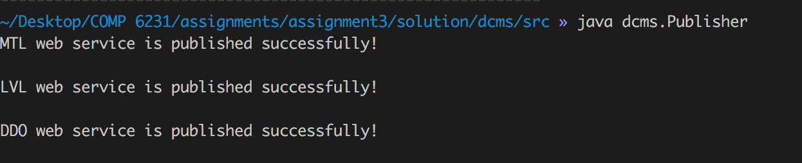

# README - Assignment 3

## Enviroment

Operating System used for running:	**MacOS 10.13.5**

Java JDK: **1.8.0_161**

<div align=center>

<p style="font-size:10px;font-color:#969696">Figure 1.1 Java JDK</p>
</div>

## Steps

### For the server side

1. Go to the source file directory (**src/**)

	<div align=center>
	
	<p style="font-size:10px;font-color:#969696">Figure 	1.2 Directory</p>
	</div>

2. Run the server file

	```
	> java dcms.Publisher
	```

	<div align=center>
	
	<p style="font-size:10px;font-color:#969696">Figure 	1.3 Start Server</p>
	</div>

### For the client side

1. Go to the source file directory (**src/**)

	<div align=center>
	
	<p style="font-size:10px;font-color:#969696">Figure 	1.4 Directory</p>
	</div>

2. Run the server file with a parameter

	```
	> java dcms.ManagerClient MTL0001
	```

	<div align=center>
	
	<p style="font-size:10px;font-color:#969696">Figure 	1.5 Start Client</p>
	</div>