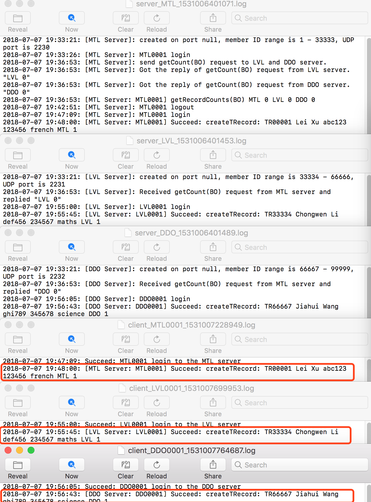
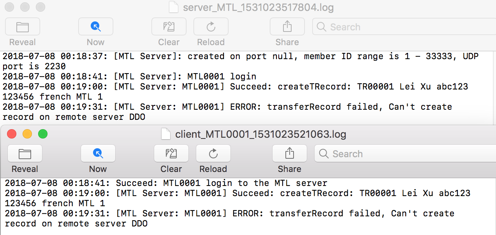
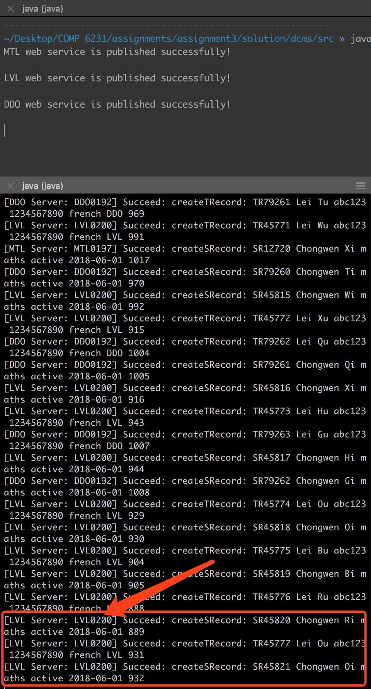

# DCMS Design Documentation - Web Service

[toc]

<div style="page-break-after: always"></div>

## 1. Background

Our team is going to implement a simple Distributed Class Management System, used by center managers to manage information about teachers and students across different centers.

In the report, we will discuss the key technology (**Web Service**) first, then design some proper and sufficient test scenarios to perform a comprehensive test.

## 2. Implementation

### 2.1 Techniques

**Web Service** allows us to invoke methods of a remote object through HTTP over Internet, which provides a great way to spread out our applications over network. 

> A **Web service** is a software system designed to support interoperable machine-to-machine interaction over a network. It has an interface described in a machine-processable format (specifically WSDL). Other systems interact with the Web service in a manner prescribed by its description using SOAP-messages, typically conveyed using HTTP with an XML serialization in conjunction with other Web-related standards.

A popular interpretation of Web services is based on IBM’s Web service architecture based on three elements:

1. **Service requester**: The potential user of a service (the client)
2. **Service provider**: The entity that implements the service and offers to carry it out on behalf of the requester (the server)
3. **Service registry**: A place where available services are listed and that allows providers to advertise their services and requesters to lookup and query for services

And it reflects only what can be done with:

1. **SOAP** (Simple Object Access Protocol)
2. **UDDI** (Universal Description and Discovery Protocol)
3. **WSDL** (Web Services Description Language)

<div align=center>

<p style="font-size:10px;font-color:#969696">Figure 2.1.1 Web Service Architecture</p>
</div>

### 2.2 Architecture

As the Figure 2.2.1 shows, the whole DCMS system consists of three center servers (**MTL**, **LVL** and **DDO** respectively) and several clients. The **CenterServer** class creates three instances of the remote object implementation, exports the remote object, and then binds those instances to names (**MTL**, **LVL** and **DDO**) in a Java RMI registry. And then clients look up the remote object by names in the **service registry**, and then invoke methods on the remote object.

<div align=center>

<p style="font-size:10px;font-color:#969696">Figure 2.2.1 DCMS Principle Workflow</p>
</div>

As descriped above, the DCMS is responsible for four parts, which are: 

1. Creating teachers' and students' records
2. Editing teachers' and students' records
3. Getting the number of records
4. Transferring records from one server to another
5. Providing the log service

For the first two parts (both teachers and students) - **Creating Records**, the graph below shows how it works.

<div align=center>

<p style="font-size:10px;font-color:#969696">Figure 2.2.2 DCMS Create Records Method Workflow</p>
</div>

For the second part - **Editing Records**, the graph below shows how it works.

<div align=center>

<p style="font-size:10px;font-color:#969696">Figure 2.2.3 DCMS Edit Records Method Workflow</p>
</div>

For the third part - **Getting Records Count**, the graph below shows how it works.

<div align=center>

<p style="font-size:10px;font-color:#969696">Figure 2.2.4 DCMS Get  Records Count Method Workflow</p>
</div>

For the forth part - **Transferring Records**, the graph below shows how it works.

<div align=center>

<p style="font-size:10px;font-color:#969696">Figure 2.2.5 DCMS Transfer Records Method Workflow</p>
</div>

### 2.3 Implementation

#### 2.3.1 Define the Web Service Endpoint Interface

Firstly, we need to design an interface (**Member_Webservice.java**), where we define the methods that can be invoked by remote clients. 

The interface, **Member_Webservice**, is annotated as a web service endpoint using the **@WebService** annotation. The interface declares seven methods, all annotated with the @WebMethod annotation. @WebMethod exposes the annotated method to web service clients.

Here is the interface definition for the remote interface named **Member_Webservice**. It declares just seven methods, and the part of source code shows below.

```java
@WebService
public interface Member_Webservice {
    @WebMethod
    // The methode is to create a teacher's record
    public String createTRecord(String teacherID, ...);
    @WebMethod
    // The methode is to create a student's record
    public String createSRecord(String studentID, ...);
    @WebMethod
    // The methode is to get the number of records on the server
    public String getRecordsCount(String recordType, String memberID);
    @WebMethod
    // The methode is to edit a record on the specified server
    public String editRecord(String recordID, ...);
    @WebMethod
    // The methode is to transfer a record from one server to another server
    public String transferRecord(String recordID, ...);
    @WebMethod
    public int login(String managerID);
    @WebMethod
    public int logout(String managerID);
}
```

#### 2.3.2 Implement Web Service Endpoint (The server)

Then, we need to implement this interface as a server Class (**CenterServer.java**). And also implemented some auxiliary methods to fulfil the tasks.

A "server" class, in this context, is the class which has a **main** method that creates an instance of the remote object implementation, exports the remote object, and then binds that instance to a name in a service registery *SOAP over HTTP*. The class that contains this main method could be the implementation class itself, or another class entirely.

In this project, the main method for the server is defined in the class **CenterServer** which also implements the remote interface **Member_Webservice**. 

```java
@WebService(endpointInterface = "dcms.Member_Webservice")
public class CenterServer implements Member_Webservice {
	@Override
    public String createTRecord(...) throws RemoteException
    {...}
    @Override
    public String createSRecord(...) throws RemoteException 
    {...}
    @Override
    public String getRecordsCount(...) throws RemoteException 
    {...}
    @Override
    public String editRecord(...) throws RemoteException
    {...}
    // Main Mathod
    public static void main(String[] args) {...}
}
```
Codes below are how we implement auxiliary methods in the **CenterServer** class.

```java
	// Implementation of login with managerID
    // only record the online status, to avoid multi-login with same managerID
	@Override
    public int login(String ManagerID) throws RemoteException {...}
    @Override
    public int logout(String ManagerID) throws RemoteException {...}
    // Synchronized get the ID resource for new teacher record
    public synchronized int getRecordIDTR() throws Exception {...}
    // Synchronized get the ID resource for new student record
    public synchronized int getRecordIDSR() throws Exception {...}
```

#### 2.3.3 Create an Endpoint Publisher

Now, we need to create an endpoint publisher class (**Publisher.java**) to publish it as web services.

Codes below are how we publish it:

```java
public class Publisher {
    public static void main(String[] args){
        Endpoint endpoint = Endpoint.publish(
        	"http://localhost:8080/MTL", 
        	 new CenterServer("MTL","localhost"));
        isPublished(endpoint, "MTL");
        endpoint = Endpoint.publish(
        	"http://localhost:8080/LVL", 
        	 new CenterServer("LVL","localhost"));
        isPublished(endpoint, "LVL");
        endpoint = Endpoint.publish(
        	"http://localhost:8080/DDO", 
        	 new CenterServer("DDO","localhost"));
        isPublished(endpoint, "DDO");
    }
    private static void isPublished(Endpoint endpoint, String serverName) {
        if(endpoint.isPublished()) {
            System.out.println(serverName + " web service is published successfully!\n");
        } else {
            System.out.println(serverName + "web service failed to be published!\n");
        }
    }
}
```

#### 2.3.4 Build the Endpoint files via wsgen tool

Next, we need to compile java files we coded before, writing the class files to the **src/dcms** subdirectory. It then calls the **wsgen** tool to generate JAX-WS portable artifacts used by the web service. The equivalent command-line command is as follows: 

```
>> wsgen -verbose -keep -d server -s server -r server/wsdl -wsdl -cp . dcms.CenterServer
```

> 1. **-verbose** :  output messages about what the compiler is doing
> 2. **-keep** : keep generated files
> 3. **-wsdl** : generate a WSDL file.
> 4. **-cp <path>** : specify where to find user class files and wsimport extensions
> 5. **-d <directory>** : specify where to place generated output files
> 6. **-s <directory>** : specify where to place generated source files
> 7. **-r <directory>** : resource destination directory, specify where to place resouce files such as WSDLs

<div align=center>


<p style="font-size:10px;font-color:#969696">Figure 2.3.1 WSGEN</p>
</div>

Also, we can run the **Publisher** file to generate the **WSDL** file and access the wsdl content through the url **http://localhost:8080/MTL?wsdl** (LVL or DDO)

<div align=center>

<p style="font-size:10px;font-color:#969696">Figure 2.3.2 WSGEN URL</p>
</div>

#### 2.3.5 Implement the client (The client)

When the web service is deployed properly, now we are going to create web service client (**ManagerClient.java**) to access to the published service.

First, we need to find the server before we can use the service.

```java
...
//Try to login to the server,avoid Multi-online of same ManagerID
URL url	= new URL("http://localhost:8080/" + serverName + "?wsdl");
QName qName = new QName	("http://Member/","CenterServerService");
Service service = Service.create(url, qName);
Member_Webservice ServerRef = service.getPort(Member_Webservice.class);
...

```

Then we can invoke the methods through this server reference just as we call a local method. 

```java
...
ServerRef.createSRecord("", ...);
...
```

Server provides great multi-thread environment for handling income requests from clients. Because the server is capsulated as an Object, for every request, server will spawn a new thread which can provide maximum concurrency. Of course, it will bring lots of thread safe issues too. Sometimes we need to balance between the concurrency and thread safe, that means in some cases, the concurrent threads need to be synchronized back to serialized line.

#### 2.3.6 Generate & Compile the stub files via wsimport tool

Alternative, you can use **“wsimport”** tool to parse the published wsdl file, and generate necessary client files (stub) to access the published web service.

```
>> wsimport -verbose -keep -s client server/wsdl/CenterServerService.wsdl
```

> 1. **-verbose** :  output messages about what the compiler is doing
> 2. **-keep** : keep generated files
> 3. **-s <directory>** : specify where to place generated source files

It will generate necessary client files, which is depends on the provided wsdl file. In this case, it will generate one interface and one service implementation file.

<div align=center>


<p style="font-size:10px;font-color:#969696">Figure 2.3.3 WSIMPORT</p>
</div>

#### 2.3.7 Synchronize resources (The most important part)

As I mentioned above, the server spawns a new thread of the object for every new request. These threads share the data of the server object, so we need some mechanism to make sure the access to the data is thread safe.

We need to synchronize resources, the hash map and array list to store the member records, the ID resources to be assigned to members, the server side log files. we choose different ways to synchronize them.

1. For the **ID resources** (in **CenterServer.java**), we simply synchronized the whole method, cause the method to assign ID is very short and run very fast

	```java
	// Synchronized get the ID resource for new teacher record
    public synchronized int getRecordIDTR() throws Exception {
        // TODO Auto-generated method stub
        if (recordIDTR < upLimit) {
            return (++ recordIDTR);
        } else {
            return (-1);     //Id is out of range
        }
    }
    // Synchronized get the ID resource for new student record
    public synchronized int getRecordIDSR() throws Exception {
        // TODO Auto-generated method stub
        if (recordIDSR < upLimit) {
            return (++ recordIDSR);
        } else {
            return (-1);    //Id is out of range
        }
    }
	```
	
2. For the **server side log file** (in **LogFile.java**), cause each server has only one log file, all the threads spawned from this server object need to write logs to this file, only we can do is also synchronize the whole method.

	```java
	// Simple method to synchronized write log, only add date and time before the message 
	public synchronized String writeLog(String msg) {
		try{
			out.write(df.format(new Date()) + ": " + msg + "\r\n");
	    	out.flush(); 
	    }catch (Exception e){
	    	 System.out.println("Failed to write data into the logfile.");
	    }	
		return(msg);
	}
	```
	
3. For the **hash map and array list in the hash map**, because the structure of hash map in our DCMS remains unchanged throughout the whole lifetime of the server object, we never lock the whole hash map.

	When adding a new record, we firstly get the ID resource, and then try to find the right array list according to the first letter of the last name, lock the array list, and then add the
new record. (in **CenterServer.java**)

	```java
	String tempKey = lastName.substring(0, 1).toUpperCase();
   ArrayList<Member> tempList = memberRecords.get(tempKey);
   synchronized(tempList) {
	   tempList.add(student);
   	}
	```
	
	When editing one record in a list, we firstly navigate through the whole hash map, search each array list, when finding the corresponding record, I lock the array list which the record belongs to, and then edit the specified field of this record. Because in our DCMS, there is no delete operation and update operation on last name, all the records will remain in the same position after it is created. That is the reason why we lock the array list only after finding the record. (in **CenterServer.java**)

	```java
	//navigate in array list to find the record
	while (itr.hasNext()){
		Memeber tempMember = itr.next(); 
		if (tempMember.getID().equals(ID)){ 
			synchronized(tempList) {
				. . . . . . //The code to modify the field 
			}
		}
	}
	```

#### 2.3.8 Summary
	
Based on the design and implementation of DCMS above, we can conclude the relations of all the classes.

As can be seen from the UML below: 

1. **Student** and **Teacher** class extend the **MemberRecord** base class.
2. The **Member_Webservice** is an interface, which is implemented by **CenterServer** class.
3. The **CenterServer** class is the main class for the server side. 
4. The **ManagerClient** class is the main class for the clent side.

<div align=center>

<p style="font-size:10px;font-color:#969696">Figure 2.3.1 DCMS UML</p>
</div>

<div align=center>

<p style="font-size:10px;font-color:#969696">Figure 2.3.2 DCMS UML with dependency</p>
</div>

<div style="page-break-after: always"></div>

## 3. Analysis & Test

### 3.1 Scenarios for Functionality

#### 3.1.1 Scenario 01 - Login/Logout

1. **Case 1**

	***Purposes:***
	
	Check Client can assign the right server for ManagerID.

	***Steps:***
	
	1. Run the three servers (**MTL** **LVL** **DDO**): **"java dcms.Publisher"**.
	2. Run the following command: **"java dcms.ManagerClient MTL0001"**
	3. Run getRecordCounts to check records.
	4. Exit ManagerClient.
	5. Check console messages and logs on both server and client sides.

	***Hypothesis & Analysis:***
	
	Client should analyze this ManagerID MTL0001 and connect to MTL server automatically.
	
	***Result:***
	
	<div align=center>


<p style="font-size:10px;font-color:#969696">Figure 3.1.1 Login & Logout Case01</p>
</div>
	
2. **Case 2**

	***Purposes:***
	
	Check Server can refuse connection with unmatched ManagerID.
	
	***Steps:***
	
	1. Run the three servers (**MTL** **LVL** **DDO**): **"java dcms.Publisher"**.
	2. Log in the DDO server with wrong ManagerID, do as the following command: **"java dcms.ManagerClient  DDO9999999"**
	3. Try to connect to DDO server.
	4. Check console messages.

	***Hypothesis & Analysis:***

	The console returns error message (***The Manager ID is invalid***), and the DDO server refuses connection.

	***Result:***
	
	<div align=center>

<p style="font-size:10px;font-color:#969696">Figure 3.1.2 Login & Logout Case02 Console</p>
</div>

#### 3.1.2 Scenario 02 - Create Teacher Records

1. **Case 1**

	***Purposes:***
	
	Check whether servers can create new teacher records providing right data. Also check **getRecordsCount** and **logging** function are working.

	***Steps:***

	1. Run the three servers (**MTL** **LVL** **DDO**): **"java dcms.Publisher"**.
	2. Run the following command: **"java dcms.ManagerClient MTL0001"**
	3. Create a new Teacher Records with right data
	4. Run the following command: **"java dcms.ManagerClient DDO0001"**
	5. Create a new Teacher Records with right data
	6. Run the following command: **"java dcms.ManagerClient LVL0001"**
	7. Create a new Teacher Records with right data
	8. Run getRecordsCount to check records.
	9. Check console messages and logs on both server and client sides.

	***Hypothesis & Analysis:***
	
	The consoles return the messages about teachers' records just created, the same as the log file.
	
	***Result:***
	
	<div align=center>


<p style="font-size:10px;font-color:#969696">Figure 3.1.3 Create Teacher Records Case01</p>
</div>

	
2. **Case 2**

	***Purposes:***
	
	Check Server can find data error about fields' range (**"Specialization"** and **"Location"** ). Also check logging function is working.

	***Steps:***
	
	1. Run the three servers (**MTL** **LVL** **DDO**): **"java dcms.Publisher"**.
	2. Run the following command: **"java dcms.ManagerClient MTL0001"**
	3. Create new Teacher Records with wrong location data.
	4. Check console messages and logs on both server and client sides. 

	***Hypothesis & Analysis:***
	
	The console returns error message (***The location can only be MTL, LVL or DDO***), the same as the log file.

	***Result:***
	
	<div align=center>


<p style="font-size:10px;font-color:#969696">Figure 3.1.4 Create Teacher Records Case02</p>
</div>

#### 3.1.3 Scenario 03 - Create Student Records

1. **Case 1**

	***Purposes:***
	
	Check Server can create new student records providing right data. Also check getRecordCounts and logging function are working.

	***Steps:***
	
	1. Run the three servers (**MTL** **LVL** **DDO**): **"java dcms.Publisher"**.
	2. Run the following command: **"java dcms.ManagerClient MTL0001"**
	3. Create a new Student Records with right data
	4. Run the following command: **"java dcms.ManagerClient DDO0001"**
	5. Create a new Student Records with right data
	6. Run the following command: **"java dcms.ManagerClient LVL0001"**
	7. Create a new Student Records with right data
	8. Run getRecordsCount to check records.
	9. Check console messages and logs on both server and client sides.

	***Hypothesis & Analysis:***
	
	The consoles return the messages about students' records just created, the same as the log file.
	
	***Result:***
	
	<div align=center>


<p style="font-size:10px;font-color:#969696">Figure 3.1.5 Create Student Records Case01</p>
</div>

2. **Case 2**

	***Purpose:***
	
	Check Server can find data error about fields' range (**"CoursesRegistered"** and **"Status"**). Also check logging function is working.

	***Steps:***
	
	1. Run the three servers (**MTL** **LVL** **DDO**): **"java dcms.Publisher"**.
	2. Run the following command: **"java dcms.ManagerClient MTL0001"**
	3. Create new student Records with wrong courses registered or status. 
	4. Check console messages and logs on both server and client sides. 

	***Hypothesis & Analysis:***
	
	The console returns error message (***Invalid courses registered or status value***), the same as the log file.

	***Result:***
	
	<div align=center>


<p style="font-size:10px;font-color:#969696">Figure 3.1.6 Create Student Records Case02 Console</p>
</div>

#### 3.1.4 Scenario 04 - Edit Records

1. **Case 1**

	***Purpose:***
	
	Check Server can edit exiting records with right data, also check logging function is working.

	***Steps:***
	
	1. Run the three servers (**MTL** **LVL** **DDO**): **"java dcms.Publisher"**.
	2. Run the following command: **"java dcms.ManagerClient MTL0001"**
	3. Edit one teacher’s record created in previous step with right data 
	4. Edit one student’s record created in previous step with right data 
	5. Check console messages and logs on both server and client sides.

	***Hypothesis & Analysis:***
	
	The consoles return the messages about records just edited, the same as the log file.

	***Result:***
	
	<div align=center>


<p style="font-size:10px;font-color:#969696">Figure 3.1.7 Edit Records Case01</p>
</div>
	
2. **Case 2**

	***Purpose:***
	
	Check Server can find data errors, also check logging function is working.

	***Steps:***
	
	1. Run the three servers (**MTL** **LVL** **DDO**): **"java dcms.Publisher"**.
	2. Run the following command: **"java dcms.ManagerClient MTL0001"**
	3. Edit one teacher’s record created in previous step with wrong location data.
	4. Edit one student’s record created in previous step with wrong courses registered or status.
	5. Check console messages and logs on both server and client sides.

	***Hypothesis & Analysis:***
	
	The console returns corresponding error message, the same as the log file.

	***Result:***
	
	<div align=center>


<p style="font-size:10px;font-color:#969696">Figure 3.1.8 Edit Records Case02</p>
</div>
	
3. **Case 3**

	***Purpose:***
	
	Check Server has handled the non-exiting records error.

	***Steps:***
	
	1. Run the three servers (**MTL** **LVL** **DDO**): **"java dcms.Publisher"**.
	2. Run the following command: **"java dcms.ManagerClient MTL0001"**
	3. Edit one teacher’s record with non-exit ID, TR99999
	4. Edit one student’s record with non-exit ID, SR99999
	5. Check console messages and logs on both server and client sides.

	***Hypothesis & Analysis:***
	
	The console returns error message (like **"ERROR: editRecord failed. Cant't find record with XXXX"**), the same as the log file.

	***Result:***
	
	<div align=center>


<p style="font-size:10px;font-color:#969696">Figure 3.1.9 Edit Records Case03</p>
</div>

#### 3.1.5 Scenario 05 - Transfer Records

1. **Case 1**

	***Purpose:***
	
	Check the server can transfer an existing record to another remote server.

	***Steps:***
	
	1. Run the three servers (**MTL** **LVL** **DDO**): **"java dcms.Publisher"**.
	2. Run the following command: **"java dcms.ManagerClient MTL0001"**
	3. Run transfer the record TR00001 to the LVL server.
	4. Check console messages and logs on both server and client sides.

	***Hypothesis & Analysis:***
	
	The console shows the message "Succeed: transferRecord TR00001 to LVL", the same as the log file.

	***Result:***
	
	<div align=center>


<p style="font-size:10px;font-color:#969696">Figure 3.1.10 Transfer Records Case01</p>
</div>
	
2. **Case 2**

	***Purpose:***
	
	Check the server can refuse to transfer a record to same server.

	***Steps:***
	
	1. Run the three servers (**MTL** **LVL** **DDO**): **"java dcms.Publisher"**.
	2. Run the following command: **"java dcms.ManagerClient MTL0001"**.
	3. Run transfer record TR00001 to the MTL server.
	4. Check console messages and logs on both server and client sides.

	***Hypothesis & Analysis:***
	
	The console returns error message (like **"ERROR: transferRecord failed. Cant't transfer to the same server, may cause deadlock"**), the same as the log file.

	***Result:***
	
	<div align=center>


<p style="font-size:10px;font-color:#969696">Figure 3.1.11 Transfer Records Case02</p>
</div>

3. **Case 3**

	***Purpose:***
	
	Check the server can handle failure during the atomic operation of transferring.

	***Steps:***
	
	1. Add a sleep code to server in the transfer method. 
	2. Run three servers (**MTL** **LVL** **DDO**): **"java dcms.Publisher"**.
	3. Run the following command: **"java dcms.ManagerClient MTL0001"** to start a MTL clent.
	4. Stop the DDO server.
	5. Run transfer record TR00001 to DDO on client1.
	6. Check console messages and logs on both server and client sides.

	***Hypothesis & Analysis:***
	
	The console returns error message (like **"Failed to access the WSDL at: http://localhost:8080/DDO?wsdl. It failed with: http://localhost:8080/DDO?wsdl"**), and the log file says something like **"ERROR: transferRecord failed. Cant't create record on the remote server DDO"**.

	***Result:***
	
	<div align=center>


<p style="font-size:10px;font-color:#969696">Figure 3.1.12 Transfer Records Case03</p>
</div>

#### 3.1.6 Scenario 06 - Get Record Counts

1. **Case 1**

	***Purpose:***
	
	Check Server can communicate with other servers to get records count.

	***Steps:***
	
	1. Run the three servers (**MTL** **LVL** **DDO**): **"java dcms.Publisher"**.
	2. Run the following command: **"java dcms.ManagerClient MTL0001"**
	3. Run getRecordsCount (Teacher), getRecordsCount (Student), getRecordsCount (Both) separately.
	4. Check console messages and logs on both server and client sides.

	***Hypothesis & Analysis:***
	
	The consoles return the messages about records' number of all three servers, the same as the log file.

	***Result:***
	
	<div align=center>


<p style="font-size:10px;font-color:#969696">Figure 3.1.13 Get Records Count Case01</p>
</div>
	
2. **Case 2**

	***Purpose:***
	
	Check timeout mechanism in getting records count from other server.

	***Steps:***
	
	1. Run the three servers (**MTL** **LVL** **DDO**): **"java dcms.Publisher"**.
	2. Stop server LVL.
	3. Run the following command: **"java dcms.ManagerClient MTL0001"**
	4. Run getRecordCounts (Both).
	5. Check console messages and logs on both server and client sides.

	***Hypothesis & Analysis:***
	
	The console returns the "time out" message, the same as the log file.

	***Result:***
	
	<div align=center>


<p style="font-size:10px;font-color:#969696">Figure 3.1.14 Get Records Count Case02</p>
</div>

### 3.2 Scenarios for Concurrency

#### 3.2.1 Scenario 07 - Create Records Simultaneously

1. **Case 1**

	***Purpose:***
	
	1. Check Server can create new records in multi-thread environment.
	2. Check server’s response when ID resources are used up. Also check getRecordsCount and logging function are working.

	***Steps:***
	
	1. Run the three servers (**MTL** **LVL** **DDO**): **"java dcms.Publisher"**.
	2. Run 200 threads of client with ManagerID MTL0001 to MTL0200
	3. Run 200 threads of client with ManagerID LVL0001 to LVL0200
	4. Run 200 threads of client with ManagerID DDO0001 to DDO0200
	5. Each thread runs a 100 iterations of createTRecord and createSRecord with random lastName.
	6. Run getRecordsCount to check records.
	7. Exit ManagerClient.
	8. Check console messages and logs on both server and client sides.

	***Hypothesis & Analysis:***
	
	The console will return **"MTL 25435 LVL 24932 DDO 25193"** message, and there are 601 client logs (plus manager client log).

	***Result:***
	
	<div align=center>


<p style="font-size:10px;font-color:#969696">Figure 3.1.15 Create Records Simultaneously</p>
</div>


#### 3.2.2 Scenario 08 - Create & Edit Records Simultaneously

1. **Case 1**

	***Purpose:***
	
	Check Server can create new records and edit exiting data in multi-thread environment. Also check getRecordCounts and logging function are working.

	***Steps:***
	
	1. Run the three servers (**MTL** **LVL** **DDO**): **"java dcms.Publisher"**
	2. Run 400 threads of client with ManagerID MTL0001-MTL0400
	3. 200 threads runs a 150 iterations of createTRecord and createSRecord with random lastName.
	4. 100 threads runs a 150 iterations of edit one same Teacher record. 
	5. 100 threads runs a 150 iterations of edit one same student record. 
	6. Run getRecordsCount to check records.
	7. Exit ManagerClient.
	8. Check console messages and logs on both server and client sides.

	***Hypothesis & Analysis:***
	
	The console will return **"MTL 42743 LVL 0 DDO 0"** message, and there are 401 client logs (plus manager client log).

	***Result:***
	
	<div align=center>


<p style="font-size:10px;font-color:#969696">Figure 3.1.16 Create & Edit Records Simultaneously</p>
</div>